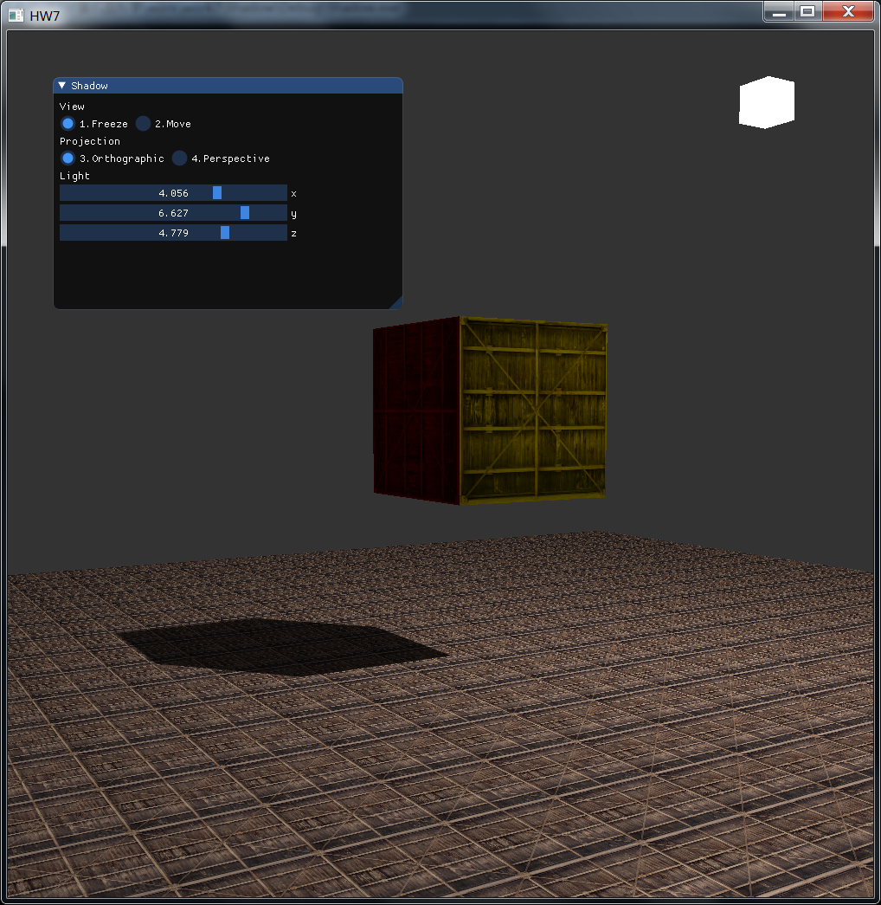

# 计算机图形学作业7

## Basic

### 1. 阴影贴图

阴影是场景中常见的元素，可以使场景看起来更加真实。虽然目前还没有完美的阴影算法，但阴影贴图算法可以实现相对逼真的阴影效果，因此在本次作业中采用阴影贴图算法来实现阴影。阴影贴图算法本质上就是将从光源视角来看被遮挡的部分设置为阴影，而判断坐标是否被遮挡由深度缓冲来确定。具体来说，阴影贴图首先从光源视角渲染场景，生成深度纹理贴图，然后在渲染场景时根据深度纹理贴图确定阴影信息。阴影贴图算法实现简单，对于平行光源的阴影效果比较好，而对于点光源的阴影效果比较差。

在场景中放置立方体、光源以及地面，阴影贴图算法实现效果如下



下面具体介绍渲染步骤。首先是从光源视角渲染场景，这里使用的顶点着色器和片段着色器分别为`shadow.vs`和`shadow.fs`。

顶点着色器如下

```c++
#version 330 core

layout(location = 0) in vec3 position;

uniform mat4 model;
uniform mat4 lightSpace;

void main() {
  gl_Position = lightSpace * model * vec4(position, 1.0f);
}
```

其中`model`矩阵确定物体的世界坐标，`lightSpace`矩阵确定物体在光源视角空间的坐标。

片段着色器如下

```c++
#version 330 core

void main() {

}
```

片段着色器不需要真正地去渲染场景，设置为空就可以得到场景的深度信息了。

从光源视角渲染场景是为了得到场景的深度信息，不需要绘制像素，因此只要确定物体在光源视角空间的坐标就可以了。渲染场景之后，根据帧缓冲的深度信息生成深度贴图。

将帧缓冲与深度贴图绑定的代码如下

```c++
GLuint depthMapFBO;
glGenFramebuffers(1, &depthMapFBO);
const GLuint SHADOW_WIDTH = 1024;
const GLuint SHADOW_HEIGHT = 1024;

GLuint depthMap;
glGenTextures(1, &depthMap);
glBindTexture(GL_TEXTURE_2D, depthMap);
glTexImage2D(GL_TEXTURE_2D, 0, GL_DEPTH_COMPONENT, SHADOW_WIDTH, SHADOW_HEIGHT, 
             0, GL_DEPTH_COMPONENT, GL_FLOAT, NULL);
glTexParameteri(GL_TEXTURE_2D, GL_TEXTURE_MIN_FILTER, GL_NEAREST);
glTexParameteri(GL_TEXTURE_2D, GL_TEXTURE_MAG_FILTER, GL_NEAREST);
glTexParameteri(GL_TEXTURE_2D, GL_TEXTURE_WRAP_S, GL_CLAMP_TO_BORDER);
glTexParameteri(GL_TEXTURE_2D, GL_TEXTURE_WRAP_T, GL_CLAMP_TO_BORDER);

glBindFramebuffer(GL_FRAMEBUFFER, depthMapFBO);
glFramebufferTexture2D(GL_FRAMEBUFFER, GL_DEPTH_ATTACHMENT, GL_TEXTURE_2D, depthMap, 0);
glDrawBuffer(GL_NONE);
glReadBuffer(GL_NONE);
glBindFramebuffer(GL_FRAMEBUFFER, 0);
```

其中`depthMapFBO`表示帧缓冲对象，`depthMap`表示深度贴图，然后通过`glDrawBuffer`和`glReadBuffer`来减少操作，在渲染场景时仅获取深度信息。

从光源视角渲染场景的代码如下

```c++
glViewport(0, 0, SHADOW_WIDTH, SHADOW_HEIGHT);
glBindFramebuffer(GL_FRAMEBUFFER, depthMapFBO);
shadowShader.use();

glBindVertexArray(cubeVAO);
glDrawArrays(GL_TRIANGLES, 0, 36);

glBindVertexArray(planeVAO);
glDrawArrays(GL_TRIANGLES, 0, 6);
```

先绑定帧缓冲并调用对应着色器，再渲染场景，这样就产生`depthMap`深度贴图了。

接下来是正常渲染场景，需要在着色器中判断像素是否属于阴影部分，思路就是在顶点着色器中计算像素的光源空间坐标，然后在片段着色器中将像素的光源空间深度与光源视角渲染深度比较，若渲染深度小于实际深度，则像素在光源视角中被遮挡，属于阴影部分，否则像素没有被遮挡。

顶点着色器如下

```c++
#version 330 core

layout(location = 0) in vec3 aPos;
layout(location = 1) in vec2 aTexCoord;
layout(location = 2) in vec3 aColor;
layout(location = 3) in vec3 aNormal;

out VS_OUT {
  vec3 FragPos;
  vec2 TexCoord;
  vec3 Color;
  vec3 Normal;	
  vec4 FragPosLightSpace;
} vs_out;

uniform mat4 model;
uniform mat4 view;
uniform mat4 projection;
uniform mat4 lightSpace;

void main() {
  gl_Position = projection * view * model * vec4(aPos, 1.0f);
  vs_out.FragPos = vec3(model * vec4(aPos, 1.0f));
  vs_out.TexCoord = aTexCoord;
  vs_out.Color = aColor;
  vs_out.Normal = mat3(transpose(inverse(model))) * aNormal;
  vs_out.FragPosLightSpace = lightSpace * vec4(vs_out.FragPos, 1.0f);
}
```

其中`model`矩阵确定物体的世界坐标，`lightSpace`矩阵确定物体在光源视角空间的坐标。

片段着色器如下

```c++
#version 330 core

in VS_OUT {
  vec3 FragPos;
  vec2 TexCoord;
  vec3 Color;
  vec3 Normal;	
  vec4 FragPosLightSpace;
} fs_in;

out vec4 FragColor;

uniform sampler2D diffuseTexture;
uniform sampler2D shadowMap;
uniform vec3 lightPos;
uniform vec3 viewPos;

float ShadowCalculation(vec4 fragPosLightSpace, float bias) {
  vec3 projCoord = fragPosLightSpace.xyz / fragPosLightSpace.w;
  projCoord = projCoord * 0.5 + 0.5;
  float currentDepth = projCoord.z;
  float cloestDepth = texture(shadowMap, projCoord.xy).r;
  return currentDepth - cloestDepth > 0 ? 1.0 : 0.0;
}

void main() {
  vec3 color = texture(diffuseTexture, fs_in.TexCoord).rgb;
  vec3 normal = normalize(fs_in.Normal);
  vec3 lightColor = vec3(1.0);

  vec3 ambient = 0.2 * lightColor;

  vec3 lightDir = normalize(lightPos - fs_in.FragPos);
  float diff = max(dot(lightDir, normal), 0.0);
  vec3 diffuse = 0.8 * diff * lightColor;

  vec3 viewDir = normalize(viewPos - fs_in.FragPos);
  vec3 reflectDir = reflect(-lightDir, normal);
  vec3 halfwayDir = normalize(lightDir + viewDir);
  float spec = pow(max(dot(normal, halfwayDir), 0.0f), 64.0);
  vec3 specular = 0.8 * spec * lightColor;
  
  float bias = max(0.05 * (1.0 - dot(normal, lightDir)), 0.005);
  float shadow = ShadowCalculation(fs_in.FragPosLightSpace, bias);
  vec3 lighting = (ambient + (1 - shadow) * (diffuse + specular));
  FragColor = vec4(lighting, 1.0) * vec4(fs_in.Color * color, 1.0);
}
```

其中`shadowCalculation`用于判断像素属于阴影的程度，将阴影应用于漫反射光照和镜面光照，再加上环境光照得到像素最终的颜色。

渲染场景实现阴影效果的代码如下

```c++
glViewport(0, 0, WINDOW_WIDTH, WINDOW_HEIGHT);
glBindFramebuffer(GL_FRAMEBUFFER, 0);
objectShader.use();

glActiveTexture(GL_TEXTURE0);
glBindTexture(GL_TEXTURE_2D, texture);

glActiveTexture(GL_TEXTURE1);
glBindTexture(GL_TEXTURE_2D, depthMap);

glBindVertexArray(cubeVAO);
glDrawArrays(GL_TRIANGLES, 0, 36);

glBindVertexArray(planeVAO);
glDrawArrays(GL_TRIANGLES, 0, 6);
```

通过深度贴图来获取阴影信息，最终渲染出阴影效果。

由于阴影贴图算法实现平行光源的阴影效果比较好，默认在光源视角使用正交投影矩阵，即实现的是平行光从光源坐标照射的阴影效果。实现阴影贴图的完整代码见`P2.cpp`，观察阴影效果的视频见`P2.mp4`。


### 2. 修改GUI

为了更好地观察阴影效果，添加视角移动的功能。在ImGui的View菜单栏中，选中Move进行移动，通过键盘按键【w】【s】【a】【d】或方向键来进行前后左右移动，通过鼠标来控制视角移动，使用滚轮可以缩放视角，选中Freeze停止移动，也可以用键盘按键【1】【2】来切换状态。

为了观察光源在不同位置的阴影效果，添加移动光源的功能。在ImGui的light菜单栏中，拖动滑块可以改变光源的坐标，可以移动光源来观察阴影的变化。

实现ImGui的完整代码见`P2.cpp`，使用ImGui的视频见`P2.mp4`。


## Bonus

### 1. 正交/透视投影下的阴影贴图

当光源为平行光时，光源视角空间的坐标为正交投影的结果；当光源为点光源时，光源视角空间的坐标为透视投影的结果。因此根据光源性质的不同，切换光源视角空间的投影矩阵来实现不同的效果。

平行光的投影矩阵如下

```c++
glm::mat4 lightOrthoProjection = glm::ortho(-10.0f, 10.0f, -10.0f, 10.0f, near_plane, far_plane);
```

点光源的投影矩阵如下

```c++
glm::mat4 lightPersProjection = glm::perspective(glm::radians(45.0f), (GLfloat)SHADOW_WIDTH / (GLfloat)SHADOW_HEIGHT, near_plane, far_plane);
```

其中`near_plane`和`far_plane`分别为光源视角平截头体的近平面和远平面。

在ImGui的Projection菜单栏中，选中Orthographic为正交投影，选中Perspective为透视投影。移动光源发现两者在大部分情况下都可以实现不错的阴影效果，但有时候会出现不合常理的阴影。实现正交/透视投影下阴影贴图的完整代码见`P2.cpp`，观察正交/透视投影下的阴影效果视频见`P2.mp4`。


### 2. 优化阴影贴图

阴影贴图算法实现的阴影效果非常简陋，需要加以改进。

首先是地面上会出现条纹样式的阴影失真，这是由于对像素采样深度时，相邻像素对深度贴图中的同一个值采样，而像素深度是离散的数值，因此就会与渲染深度有偏差，一部分深度偏大，另一部分偏小。可以采用阴影偏移的技巧，只有在当前深度超过渲染深度一定数值时，才认为像素属于阴影。

即判断阴影如下

```c++
return currentDepth - cloestDepth > bias ? 1.0 : 0.0;
```

其中`bias`为指定的偏差。

由于地面在光源空间中的坡度不同，需要调整为不同的`bias`，更好的做法是让偏差自适应地面的坡度。

计算偏差如下

```c++
float bias = max(0.05 * (1.0 - dot(normal, lightDir)), 0.005);
```

其中`normal`为像素的法向量，`lightDir`为光照的方向，这样就可以根据光照的角度来调整偏差了。

然后是不出现在光源空间中的坐标没有对应的深度信息，需要将这些部分设置为不属于阴影。具体思路就是在深度贴图的边缘加一圈非阴影，再根据边缘延伸。

设置深度贴图的属性如下

```c++
glTexParameteri(GL_TEXTURE_2D, GL_TEXTURE_WRAP_S, GL_CLAMP_TO_BORDER);
glTexParameteri(GL_TEXTURE_2D, GL_TEXTURE_WRAP_T, GL_CLAMP_TO_BORDER);
GLfloat borderColor[] = {
  1.0f, 1.0f, 1.0f, 1.0f
};
glTexParameterfv(GL_TEXTURE_2D, GL_TEXTURE_BORDER_COLOR, borderColor);
```

这样就可以确定世界空间中的所有坐标是否属于阴影了。

最后是阴影的边缘会出现锯齿的效果，这是由于判断阴影时只区分了属于阴影和不属于的阴影的像素，可以进一步计算属于阴影的程度来实现过渡效果。

计算阴影程度如下

```c++
float shadow = 0.0;
vec2 texelSize = 1.0 / textureSize(shadowMap, 0);
for (int i = -1; i <= 1; ++i) {
  for (int j = -1; j <= 1; ++j) {
    float pcfDepth = texture(shadowMap, projCoord.xy + vec2(i, j) * texelSize).r;
    shadow += (currentDepth > 1.0 || currentDepth - pcfDepth < bias) ? 0.0f : 1.0f;
  }
}
return shadow / 9.0;
```

计算阴影程度的思路就是取周围的9个像素，根据属于阴影的像素数量来确定当前像素的阴影程度。

优化阴影贴图的完整代码见`P2.cpp`，观察优化的阴影效果视频见`P2.mp4`。